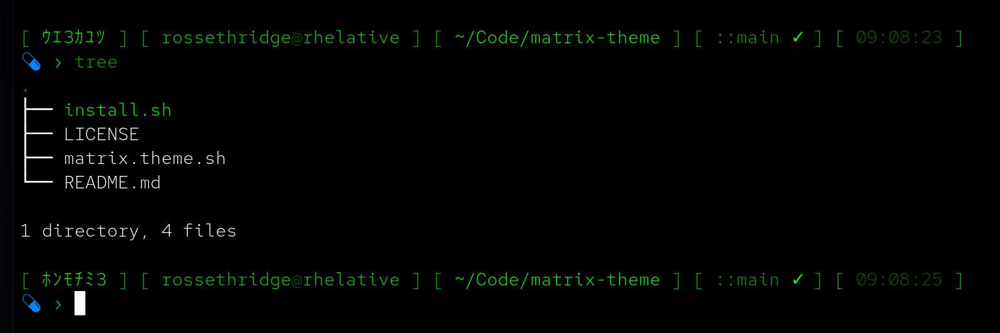

# matrix.theme.sh

A Matrix "digital rain" theme for [oh-my-bash](https://github.com/ohmybash/oh-my-bash). Green-on-dark, half-width katakana rain in the header, and a blue-pill / red-pill prompt marker.



```
[ ｱｷﾒﾜﾕ ] [ user@host ] [ ~ ] [ ::git ✓ ] [ 01:39:58 ]
 › your command here
```

- **Line 1:** bold neon katakana rain · `user@host` · path · git branch with `✓`/`✗` · clock
- **Line 2:** the pill is **blue** normally, flips **red** with the exit code (`›1`) when the last command failed — the blue-pill / red-pill reference. Typed input is dim green.
- Colors: neon (`46`) → medium (`40`) → dim (`34`) → dark (`22`) Matrix greens.
- Ships matching `LS_COLORS` / `EZA_COLORS` palettes and uses [`eza`](https://github.com/eza-community/eza) for colored listings if it's installed (falls back to plain `ls` silently).

## Install

Requires oh-my-bash, **bash 4+**, and a [Nerd Font](https://www.nerdfonts.com/) (v3+) installed and selected in your terminal — the pill is the `nf-md-pill` glyph (`U+F0402`), not the Unicode 💊 emoji. Emoji are drawn from color fonts (Segoe UI Emoji, Apple Color Emoji, Noto Color Emoji) whose glyph colors are baked in and ignore ANSI recoloring; a Nerd Font icon is a plain vector glyph, so the blue/red pill renders correctly on any terminal — Linux, macOS, and Windows Terminal (including over WSL) — as long as the font is installed. Without a Nerd Font, the pill shows as a missing-glyph box.

```bash
git clone git@github.com:ross-ethridge/matrix-theme.git
cd matrix-theme
./install.sh
```

Then set the theme in your `~/.bashrc`:

```bash
OSH_THEME="matrix"
```

and reload: `source ~/.bashrc`.

The installer just copies `matrix.theme.sh` into `${OSH:-~/.oh-my-bash}/custom/themes/matrix/`. You can also do it by hand.

## macOS notes

The theme is pure bash + ANSI and runs fine on macOS, but:

- **Use Homebrew bash, not the system one.** macOS ships bash 3.2 (2007); oh-my-bash wants 4+.
  ```bash
  brew install bash
  echo /opt/homebrew/bin/bash | sudo tee -a /etc/shells   # /usr/local on Intel
  chsh -s /opt/homebrew/bin/bash
  ```
- **`.bash_profile` vs `.bashrc`** — Terminal/iTerm open *login* shells, which read `~/.bash_profile`, not `~/.bashrc`. Add to `~/.bash_profile`:
  ```bash
  [[ -r ~/.bashrc ]] && source ~/.bashrc
  ```
- **The pill** needs a Nerd Font installed and selected in Terminal.app/iTerm2's profile, same as any other platform — see [Install](#install).
- `eza` via `brew install eza`.

## License

MIT — see [LICENSE](LICENSE).
